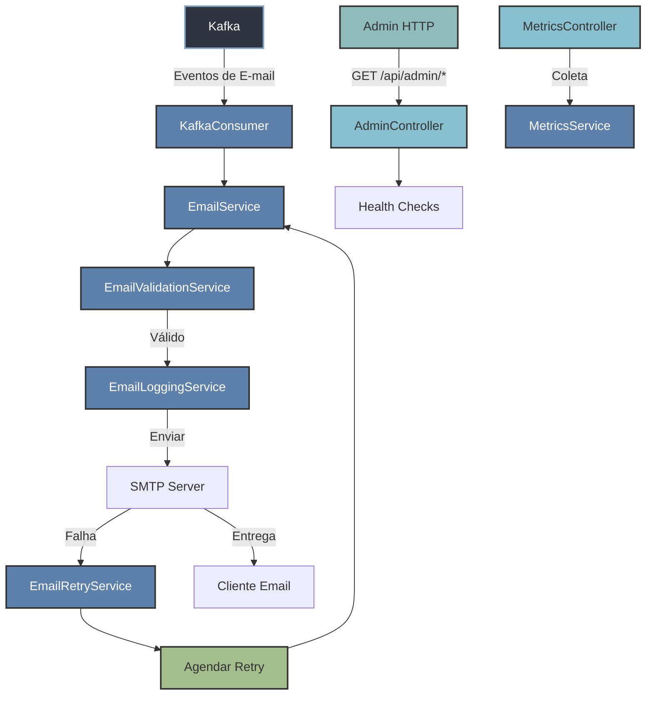

# Diagrama de Arquitetura - MS Email

## Descrição dos Componentes

### Controladores
- **EmailController**: Gerencia as requisições HTTP de envio de e-mail
- **MetricsController**: Fornece métricas de monitoramento da aplicação
- **AdminController**: Endpoints administrativos e verificação de saúde

### Serviços
- **EmailService**: Lógica principal de processamento e envio de e-mails
- **EmailValidationService**: Validação de endereços de e-mail
- **EmailLoggingService**: Registro de logs das operações de e-mail
- **EmailRetryService**: Gerenciamento de tentativas de reenvio em caso de falhas
- **MetricsService**: Coleta e fornece métricas de operação

### Componentes de Infraestrutura
- **KafkaConsumer**: Consome mensagens de uma fila Kafka para processamento assíncrono
- **Kafka**: Broker de mensagens para comunicação assíncrona
- **SMTP Server**: Servidor de e-mail para envio das mensagens

### Armazenamento
- **EmailRetryRepository**: Armazena informações sobre tentativas de reenvio

## Fluxo de Dados
1. **Fluxo Síncrono (HTTP)**:
   - Cliente faz uma requisição POST para /api/email
   - EmailController recebe e delega para EmailService
   - EmailService valida e processa o e-mail
   - Em caso de sucesso, o e-mail é enviado via SMTP
   - Em caso de falha, o EmailRetryService agenda novas tentativas

2. **Fluxo Assíncrono (Kafka)**:
   - Mensagens são publicadas no tópico configurado do Kafka
   - KafkaConsumer recebe e processa as mensagens
   - O fluxo segue o mesmo processamento do fluxo síncrono

3. **Monitoramento**:
   - Métricas são coletadas automaticamente
   - Endpoints de saúde estão disponíveis via AdminController

## Dependências Principais
- Spring Boot 3.3.2
- Spring Kafka
- Spring Mail
- Spring Web
- Spring Actuator (Métricas e Health Checks)
- Lombok
- ModelMapper
- H2 Database (para testes)
- Spring Data JPA
- Spring AMQP (RabbitMQ)
- Jackson (JSON processing)
- Thymeleaf (Template Engine para e-mails)
- Resilience4j (Circuit Breaker e Retry)
- Micrometer (Métricas)
- SpringDoc OpenAPI (Documentação da API)
