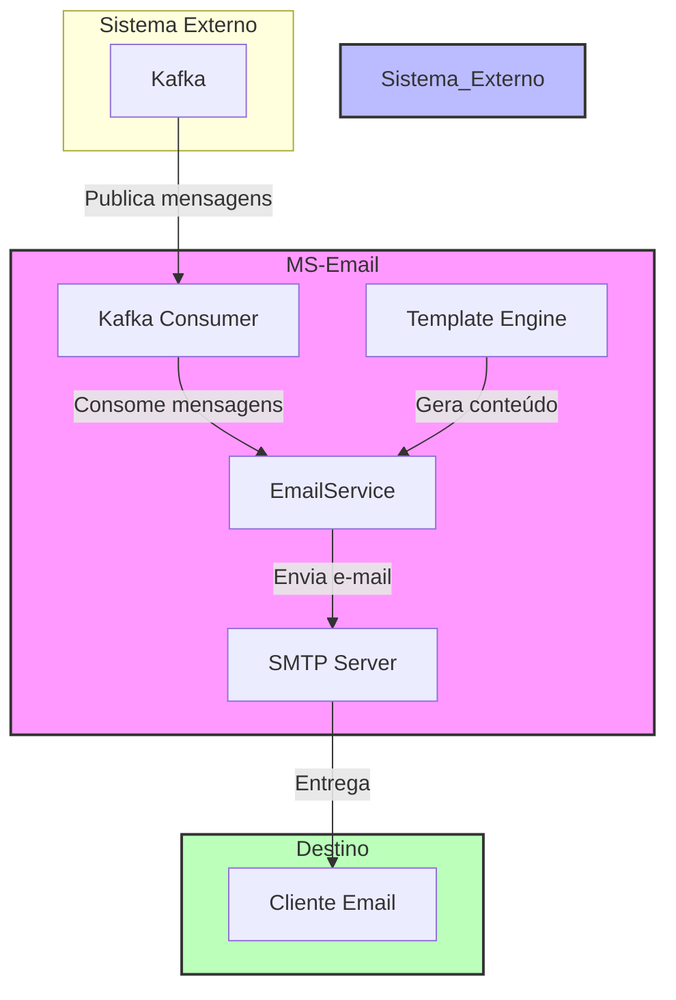

# Diagrama de Arquitetura - MS Email

## Descrição dos Componentes

### MS-Email (Microserviço)
- **Kafka Consumer**: Consome mensagens de um tópico Kafka
- **EmailService**: Processa as mensagens e gerencia o envio de e-mails
- **Template Engine**: Gera o conteúdo HTML dos e-mails usando templates

### Sistema Externo
- **Kafka**: Broker de mensagens que publica eventos para o microserviço

### Destino
- **SMTP Server**: Servidor de e-mail responsável pelo envio das mensagens
- **Cliente Email**: Destinatário final dos e-mails

## Fluxo de Dados
1. Um evento é publicado no Kafka
2. O Kafka Consumer do MS-Email consome a mensagem
3. O EmailService processa a mensagem e gera o e-mail usando o Template Engine
4. O e-mail é enviado através do servidor SMTP configurado
5. O destinatário final recebe o e-mail

## Dependências Principais
- Spring Boot 3.3.2
- Spring Kafka
- Spring Mail
- Thymeleaf (Template Engine)
- Lombok
- Spring Web
- Spring AMQP (RabbitMQ)
- Jackson (JSON processing)
